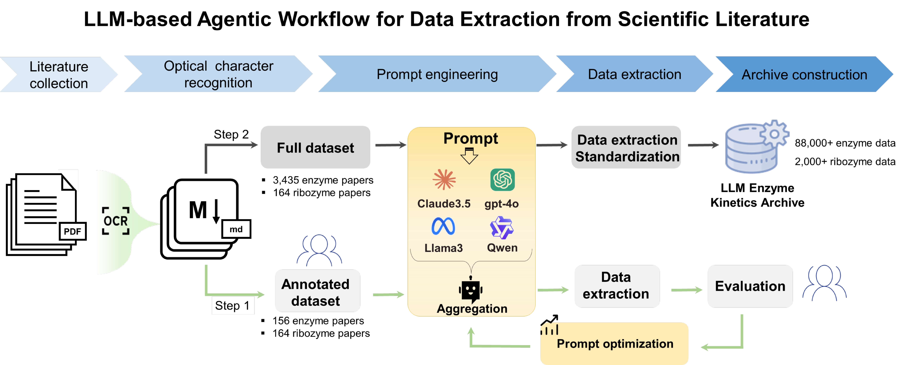
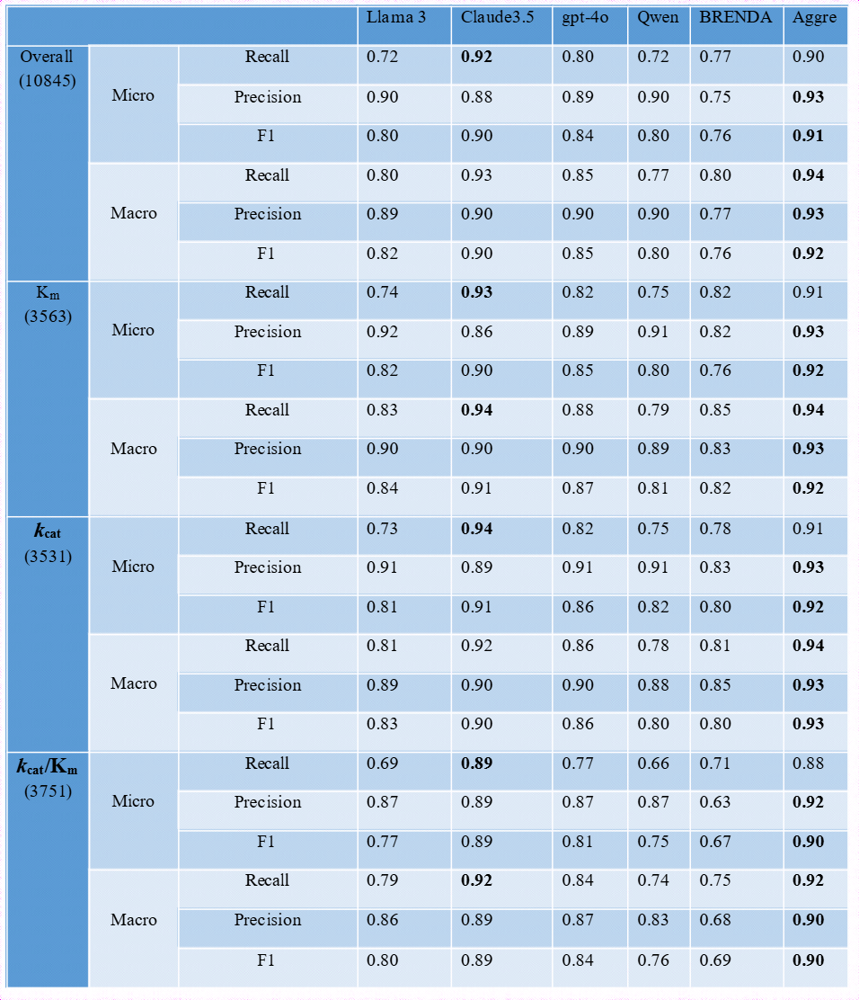
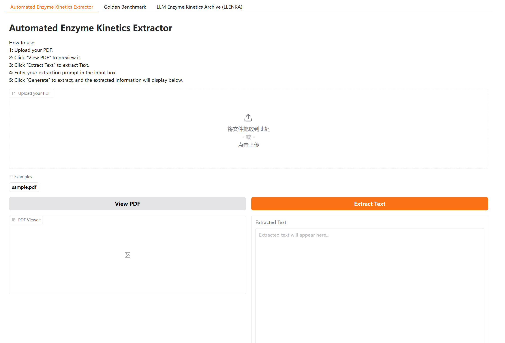
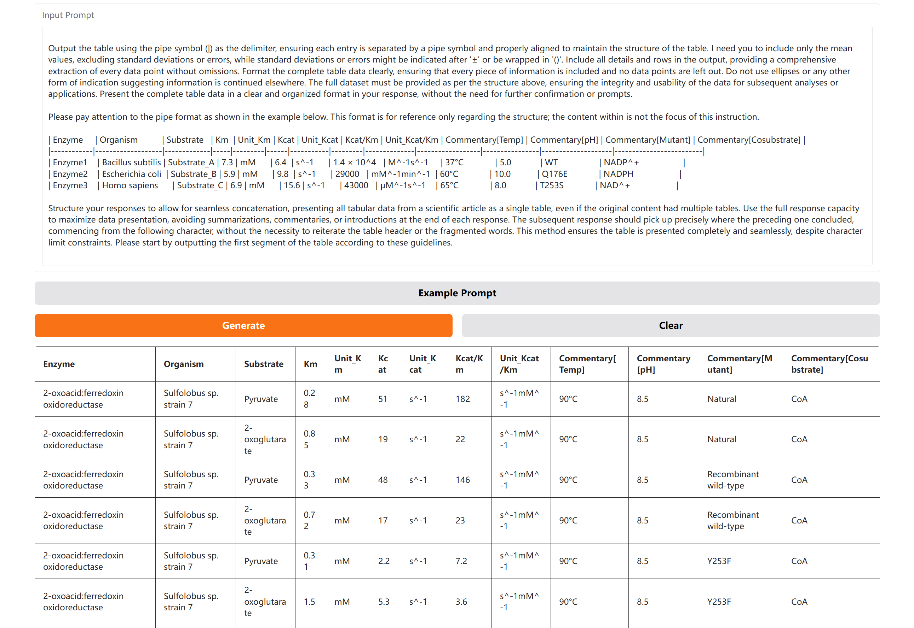
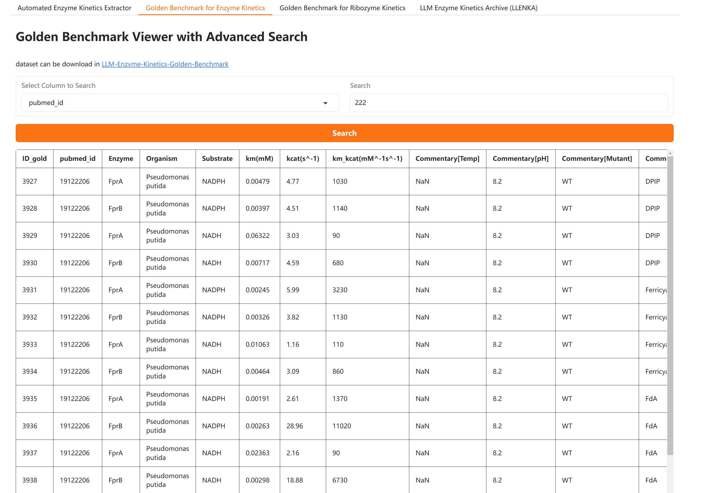
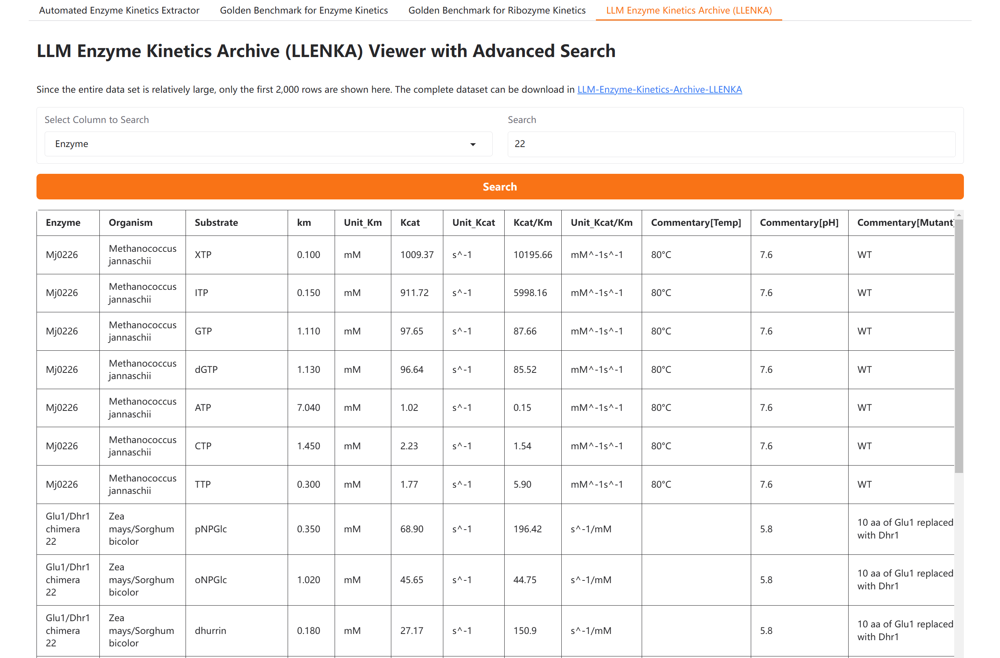

# LLM-BioDataExtractor

## Introduction

`LLM-BioDataExtractor` is an automated pipeline that leverages large language models (LLMs) to extract various biochemical data, including enzyme kinetics parameters (e.g., Km, Kcat), enzyme activity, and ribozyme data, from scientific literature. The pipeline consists of three main steps:

1. **PDF to Markdown (pdf_2_md)**: Converts PDF files to Markdown format.
2. **LLM Data Extraction (LLM_extract_data)**: Extracts key biochemical data from Markdown files using LLMs.
3. **Evaluate Extracted Data (evaluate_extracted_data)**: Compares the extracted data with ground truth to assess accuracy.

- Fig. 1 Schematic of our LLM-based agentic workflow for enzyme kinetic data extraction.




- Table 1. Overall performance of various models examined on the annotated dataset of 156 protein enzyme papers. 


- 

## Online tools and Data Portal

We offer a suite of online tools and a data portal designed to streamline access to and processing of biological data. Key features include:

- **Automated Enzyme Kinetics Extractor**: A user-friendly tool for extracting enzyme kinetics data from scientific literature.
- **Golden Benchmark for Enzyme Kinetics**: A simple interface for searching and browsing a collection of benchmark datasets, enabling the evaluation of enzyme kinetics extraction models.
- **Golden Benchmark for Ribozyme Kinetics**: A simple interface for searching and browsing a collection of benchmark datasets, enabling the evaluation of ribozyme kinetics extraction models.
- **LLM Enzyme Kinetics Archive (LLENKA)**: An intuitive platform for searching and browsing a comprehensive dataset sourced from 3,435 articles. LLENKA provides the research community with a structured, high-quality resource of enzyme kinetics data, advancing future research endeavors.

Visit the [Automated-Enzyme-Kinetics-Extractor](https://huggingface.co/spaces/jackkuo/Automated-Enzyme-Kinetics-Extractor) for more details and to start using these tools.













You can also download the dataset from here:
- **[Golden Benchmark for Enzyme Kinetics](https://huggingface.co/datasets/jackkuo/LLM-Enzyme-Kinetics-Golden-Benchmark)**
- **[Golden Benchmark for Ribozyme Kinetics](https://huggingface.co/datasets/jackkuo/LLM-Ribozyme-Kinetics-Golden-Benchmark)**
- **[LLM Enzyme Kinetics Archive (LLENKA)](https://huggingface.co/datasets/jackkuo/LLM-Enzyme-Kinetics-Archive-LLENKA)**

## Installation

Ensure the required dependencies are installed:


```bash
pip install -r requirements.txt
```

## Usage

### 1. PDF to Markdown

Convert PDF files to Markdown format and process documents with no more than 50 (customizable, 50 by default) pages.
```python
from extract_pipeline import pdf_2_md
pdf_2_md()
```

### 2. LLM Data Extraction

Extract key biochemical data from Markdown files and save it in the response folder.


```python
from extract_pipeline import LLM_extract_data
LLM_extract_data()
```

#### [Optional] LLM Response Aggregation Pipeline

`s2_LLM_data_extract/LLM_response_aggregate.py` is a Python script designed for aggregating responses from 4 language model responses.

##### Usage
Place Markdown files of scientific literature in the `data/md/` directory, and place 4 model responses in the `data/response/` directory. The script will process these responses and aggregate them into a single response.

```bash 
python LLM_response_aggregate.py
```


### 3. Evaluate Extracted Data

Compare the extracted data with ground truth to assess accuracy.

```python
from extract_pipeline import evaluate_extracted_data
evaluate_extracted_data()
```

## Directory Structure
```
.
├── analyze_code             # Code for analyzing extracted data
│   ├── data                 # Data files used for analysis
│   │   └── ...  
│   │
│   ├── analyzing.ipynb      # Jupyter notebook for analyzing extracted data
│   ├── requirements.txt     # Required dependencies
│   └── readme.md            # Project overview and usage instructions
│
├── data                # Data files used for extraction and evaluation
│   ├── pdf             # PDF files to be processed
│   ├── md              # Converted Markdown files
│   ├── txt             # Extracted text files
│   ├── response        # Extracted data files
│   └── results         # Evaluation results
│
├── prompt              # Prompt files
│   ├── p_3_2_0806.txt  # Prompt for data extraction
│   └── p_2_0826.txt    # Prompt for merge data
│
├── s1_pdf_2_md             # PDF to Markdown conversion pipeline
│   ├── ocr_mathpix.py      # High-performance PDF to Markdown conversion
│   ├── ocr_pymupdf.py      # Free but less effective PDF to text conversion
│   ├── readme.md           # Usage instructions
│   └── readme_pymupdf.md   # Instructions for text conversion logic
│
├── s2_LLM_extract_data         # LLM data extraction pipeline
│   ├── LLM_data_extraction.py  # Main logic for data extraction
│   ├── LLM_response_aggregate.py # Aggregate responses
│   └── readme.md               # Usage instructions
│
├── s3_evaluate_extracted_data      # Evaluation pipeline
│   ├── evaluate_extracted_data.py  # Main logic for evaluation
│   └── readme.md                   # Usage instructions
│
├── extract_pipeline.py  # Main processing logic
├── readme.md            # Project overview
└── requirements.txt     # Dependency list
```

## Parameter Descriptions

### `pdf_2_md()`

- **data_folder_dir**: Path to the data folder, default is `"data/"`.
- **pdf_folder_dir**: Path to the PDF folder, default is `"data/pdf"`.
- **md_folder_dir**: Path to the Markdown folder, default is `"data/md"`.

### `LLM_extract_data()`

- **md_folder**: Path to the Markdown folder, default is `"data/md/"`.
- **response_folder**: Path to the response folder, default is `"data/response/"`.
- **prompt_extract_dir**: Path to the extraction prompt file, default is `"prompt/p_3_2_0806.txt"`.
- **prompt_merge_dir**: Path to the merging prompt file, default is `"prompt/p_2_0826.txt"`.

### `evaluate_extracted_data()`

- **response_dir**: Path to the folder containing LLM extraction results, default is `'data/response/prompt_p_3_2_0806_claude-3-5-sonnet-20240620_128k_stream_max_tokens_8192_temperature_0.1'`.
- **ground_truth_dir**: Path to the ground truth file, default is `'data/ground_truth/km_kcat_all.csv'`.
- **seq**: Delimiter, default is `"|"`.
- **order**: Target column index, default is `-7`.
- **have_dir**: Whether subdirectories exist, default is `0`.

## Analyzing extracted data 

This section provides a detailed guide on how to use the `analyze_code` directory. The directory contains a Jupyter notebook, `analyzing.ipynb`, which can be used to analyze the extracted data. The notebook includes code snippets for loading and analyzing the extracted data, as well as visualizing the results.


## Logging

The script uses the `logging` module for recording logs. By default, the log level is set to `INFO`. You can adjust the log level as needed.

```python
import logging
logging.basicConfig(level=logging.INFO, format='%(asctime)s - %(levelname)s - %(message)s')
```
## Notes

1. Ensure all paths and filenames are correct.
2. Complete the `pdf_2_md` step successfully before running `LLM_extract_data`.
3. Complete the `LLM_extract_data` step successfully before running `evaluate_extracted_data`.


## Citation
Please cite this project if you find it useful in your research:
```bibtex
@article {Jiang2025.03.03.641178,
	author = {Jiang, Jinling and Hu, Jie and Xie, Siwei and Guo, Menghao and Dong, Yuhang and Fu, Shuai and Jiang, Xianyue and Yue, Zhenlei and Shi, Junchao and Zhang, Xiaoyu and Song, Minghui and Chen, Guangyong and Lu, Hua and Wu, Xindong and Guo, Pei and Han, Da and Sun, Zeyi and Qiu, Jiezhong},
	title = {Enzyme Co-Scientist: Harnessing Large Language Models for Enzyme Kinetic Data Extraction from Literature},
	elocation-id = {2025.03.03.641178},
	year = {2025},
	doi = {10.1101/2025.03.03.641178},
	publisher = {Cold Spring Harbor Laboratory},
	abstract = {The extraction of molecular annotations from scientific literature is critical for advancing data-driven research. However, traditional methods, which primarily rely on human curation, are labor-intensive and error-prone. Here, we present an LLM-based agentic workflow that enables automatic and efficient data extraction from literature with high accuracy. As a demonstration, our workflow successfully delivers a dataset containing over 91,000 enzyme kinetics entries from around 3,500 papers. It achieves an average F1 score above 0.9 on expert-annotated subsets of protein enzymes and can be extended to the ribozyme domain in fewer than 3 days at less than $90. This method opens up new avenues for accelerating the pace of scientific research.Competing Interest StatementThe authors have declared no competing interest.},
	URL = {https://www.biorxiv.org/content/early/2025/03/11/2025.03.03.641178},
	eprint = {https://www.biorxiv.org/content/early/2025/03/11/2025.03.03.641178.full.pdf},
	journal = {bioRxiv}
}

```
---

Thank you for using `LLM-BioDataExtractor`! We hope it helps you efficiently process and analyze a wide range of biochemical data from scientific literature.
